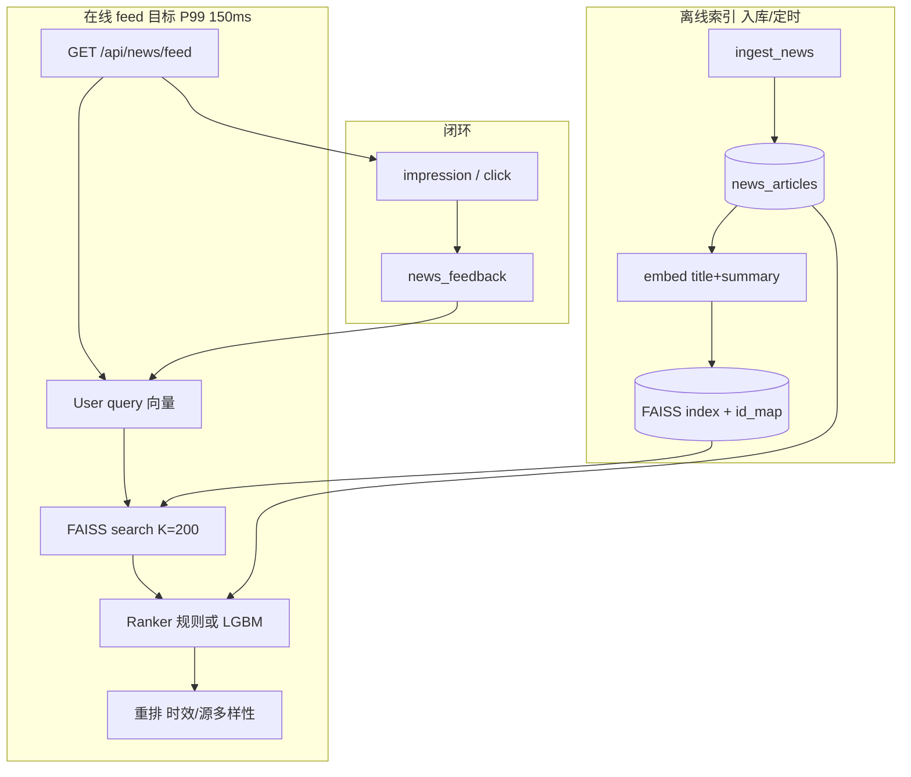

# TenClip 资讯推荐 M1 实现方案

> **M1 目标**：在保持 **实时低延迟**（P99 &lt; 150ms）的前提下，把 `recommend_news()` 从「SQLite 全表扫描 + 规则分」升级为 **向量召回 + 轻量精排**，并打通 **曝光/点击日志**，为 M2 序列模型留接口。  
> 总览与论文清单见 [`recsys-realtime-roadmap.md`](./recsys-realtime-roadmap.md)。

---

## 1. 范围

### 1.1 做什么（M1 In Scope）

| 项 | 说明 |
|----|------|
| **Item 向量** | 入库时对 `title + summary` 算 embedding，持久化 |
| **ANN 召回** | FAISS（CPU）Top-K=200，毫秒级 |
| **精排** | 首版 **规则 + 线性加权**（与现逻辑等价可 A/B）；可选 **LightGBM**（有反馈数据后） |
| **用户侧** | 显式 tags + 最近正反馈文章的向量 **加权平均** → query 向量 |
| **曝光日志** | 新增 `impression` action；feed 返回时可选异步写 |
| **降级** | 索引缺失 / FAISS 失败 → **回退现有规则全表扫** |
| **API** | `/api/news/feed` **请求/响应形状不变**，仅 `score` 语义更稳定 |

### 1.2 不做什么（M1 Out of Scope）

- 全链路 LLM 精排、生成式 Semantic ID
- SASRec / DIN 在线序列（→ M2）
- Kafka、独立 Feature Store（→ 数据量 &gt;10 万 DAU 再考虑）
- GPU 向量服务（tennisGo CentOS7 4G 先用 **CPU + 小模型**）
- 视频 item 与资讯统一索引（→ M2，预留 `item_type` 字段）

---

## 2. 现状 vs M1

```text
【M0 现在】
  ingest → news_articles (SQLite)
  feed   → SELECT … ORDER BY published_at LIMIT 400
         → Python 循环算 freshness + tag_overlap + popularity
         → sort → slice

【M1 目标】
  ingest → news_articles + embedding BLOB + FAISS index 增量更新
  feed   → 构建 user_query_vec
         → FAISS Top-200 (≈5–15ms)
         → 精排特征 → score (≈5–20ms)
         → 多样性重排 (≈&lt;5ms)
         → slice + 可选写 impression
```

| 维度 | M0 | M1 |
|------|----|----|
| 候选集 | 最近 400 条全扫 | ANN 全库 Top-200 |
| 个性化 | 标签交集 + 热度 | 向量相似 + 标签 + 热度 |
| 复杂度 | O(n) 随文章增多变慢 | O(log n) 召回，n 可到 10⁵+ |
| 冷启动文章 | 靠时效进 Top400 | 入库即有向量，可召回 |
| 可训练 | 无 | 曝光/点击日志 → LightGBM |

---

## 3. 架构



---

## 4. 数据模型

### 4.1 `news_articles` 扩展

```sql
ALTER TABLE news_articles ADD COLUMN embedding BLOB;          -- float32 向量 raw bytes
ALTER TABLE news_articles ADD COLUMN embedding_model TEXT;    -- 如 paraphrase-MiniLM-L6-v2
ALTER TABLE news_articles ADD COLUMN embedding_dim INTEGER; -- 384
```

- 向量 **norm 后** 存入，FAISS 用 **IndexFlatIP**（内积 = cosine，因已 L2 normalize）
- 旧数据：`embedding IS NULL` 时 ingest 补算；或 `scripts/news_reindex_embeddings.py` 批量回填

### 4.2 `news_feedback` 扩展

```sql
-- action 增加 impression（仅曝光，不修改 popularity）
-- 现有: view, click, like, dislike, bookmark, read
```

| action | M1 行为 |
|--------|---------|
| `impression` | 写入日志；训练样本 label=0 |
| `click` / `read` | label=1；popularity +1 |
| `like` / `bookmark` | label=1；popularity +3.5 |
| `dislike` | 负样本；popularity -2；精排降权 |

### 4.3 索引文件（与 DB 并列）

```text
data/news_feed/
  faiss.index          # FAISS 索引
  faiss_id_map.json    # faiss_row → news_articles.id
  ranker.lgb.txt       # 可选 LightGBM 模型
  meta.json            # model_name, dim, built_at, article_count
```

环境变量：

```bash
TENCLIP_NEWS_INDEX_DIR=data/news_feed
TENCLIP_NEWS_EMBED_MODEL=paraphrase-multilingual-MiniLM-L12-v2  # 中英文 tag 友好
TENCLIP_NEWS_RECALL_K=200
TENCLIP_NEWS_RANKER=rule   # rule | lightgbm
```

---

## 5. Embedding 方案

### 5.1 模型选型（M1 默认）

| 模型 | 维度 | 体积 | 说明 |
|------|------|------|------|
| **`paraphrase-multilingual-MiniLM-L12-v2`**（推荐） | 384 | ~470MB | 中英文网球 tag/标题均可 |
| `paraphrase-MiniLM-L6-v2` | 384 | ~90MB | 仅英文源时可省内存 |
| API（OpenAI 等） | — | — | M1 不用；延迟与成本不适合 ingest 批量 |

**输入文本**：

```text
{title}. {summary}   # summary 空则只用 title
tags: {tags_csv}     # 可选拼接到末尾，增强 tag 信号
```

### 5.2 何时计算

1. **`ingest_news()`** 插入/更新文章后 **同步或线程池** 算 embedding（单条 &lt;50ms CPU）
2. **批量脚本** `scripts/news_reindex_embeddings.py`：历史回填 + 重建 FAISS
3. **不**在 `/api/news/feed` 请求路径上算 item embedding

### 5.3 依赖

```text
# requirements-news-rec-m1.txt（新建，与主 requirements 分离）
sentence-transformers>=2.2.0
faiss-cpu>=1.7.4
numpy>=1.26,<2
lightgbm>=4.0.0   # 可选，训练阶段
```

CentOS7 / 4G 机器：首次加载模型约 1–2GB RAM；可与 TenClip 主进程 **分进程**（见 §8）。

---

## 6. 召回（FAISS）

### 6.1 索引类型

| 阶段 | 索引 | 条件 |
|------|------|------|
| M1 初 | `IndexFlatIP` | 文章 &lt; 2 万，最简单、可复现 |
| M1 后期 | `IndexIVFFlat` + `nlist=sqrt(n)` | 文章 &gt; 2 万，需 `train` |

### 6.2 User query 向量

```text
query_vec = normalize(
    w_tag   * embed(mean_user_tags_text)     # 用户 profile tags 拼成一句
  + w_hist  * mean(last_k_positive_embeddings) # 最近 click/like 的 item 向量，k≤10
  + w_pop   * 0                              # M1 不加全局向量
)
```

权重默认：`w_tag=0.6`, `w_hist=0.4`；无 tags 且无历史 → **全局热门 + 时效** 召回（见 §6.4）。

### 6.3 搜索

```python
scores, faiss_rows = index.search(query_vec, k=RECALL_K)  # RECALL_K=200
article_ids = [id_map[row] for row in faiss_rows[0] if row >= 0]
```

### 6.4 冷启动 / 降级

| 情况 | 策略 |
|------|------|
| 无 user_id、无 tags、无历史 | FAISS 用 **时效加权中心** 或退化为 `ORDER BY published_at` Top-K |
| `faiss.index` 不存在 | **整段回退 M0** `recommend_news_legacy()` |
| embedding 缺失的文章 | 不参与索引；ingest 后下次 rebuild 纳入 |

---

## 7. 精排（Ranker）

### 7.1 Phase A — 规则精排（M1 第一周，零训练）

在召回 200 条上算 **与 M0 兼容** 的特征，便于对比：

| 特征 | 说明 |
|------|------|
| `cos_sim` | query · item 向量内积 |
| `tag_overlap` | \|user_tags ∩ article_tags\| |
| `freshness` | 同 M0：`max(0, 120 - age_hours*2)` |
| `source_tier` | 1–3 → bonus |
| `popularity` | 表字段 |
| `dislike_penalty` | 用户 dislike 过则 ×0 或剔除 |

**Score（默认）**：

```text
score = 40*cos_sim + 20*tag_overlap + freshness + 4*source_tier + popularity
```

输出仍带 `score` 字段；可通过 `TENCLIP_NEWS_RANKER=rule` 固定。

### 7.2 Phase B — LightGBM（有 ≥5000 条曝光日志后）

**样本**：`impression` + 是否 `click`/`read`（within 24h）→ 0/1  
**特征**：上表 + `hour_of_day`, `source_domain hash`, `title_len`  
**训练**：离线 `scripts/news_train_ranker.py`，产出 `ranker.lgb.txt`  
**在线**：`predict` 200 条 → sort（CPU &lt;10ms）

---

## 8. 重排（Rerank）

在精排 Top `limit+offset` 窗口上做 **轻量规则**（&lt;5ms）：

1. **来源多样性**：同一 `source_domain` 连续不超过 2 条  
2. **时效保底**：最终 list 中至少 20% 为 24h 内文章（可调）  
3. **dislike 过滤**：用户点过 dislike 的 `article_id` 不再出现  

---

## 9. 代码结构（拟新增）

```text
services/
  news_feed.py              # 保留 ingest/feedback；recommend_news 调 orchestrator
  news_rec/
    __init__.py
    embedder.py             # SentenceTransformer 单例 + encode()
    index_store.py          # FAISS load/search/rebuild
    user_vector.py          # query 向量 from tags + history
    rank_rule.py            # Phase A 规则分
    rank_lgb.py             # Phase B 可选
    rerank.py               # 多样性 / dislike
    recommend.py            # recommend_news_m1() 主入口
    legacy.py               # recommend_news_legacy() 原 M0 逻辑

scripts/
  news_reindex_embeddings.py
  news_rebuild_faiss.py
  news_train_ranker.py      # Phase B

config/
  news_rec.yaml             # 权重、K、模型名（或用 env）

data/news_feed/             # 索引与模型产物（gitignore）
```

### 9.1 `recommend_news()` 入口改造

```python
def recommend_news(inp: RecommendInput) -> list[dict[str, Any]]:
    if os.environ.get("TENCLIP_NEWS_REC_ENGINE", "m1") == "legacy":
        return recommend_news_legacy(inp)
    try:
        return recommend_news_m1(inp)
    except Exception:
        logger.exception("M1 recommend failed, fallback legacy")
        return recommend_news_legacy(inp)
```

**API 无 breaking change**。

---

## 10. API 与前端

### 10.1 现有接口（不变）

```http
GET /api/news/feed?user_id=&tags=阿尔卡拉斯,辛纳&limit=20&offset=0
POST /api/news/feedback  user_id, article_id, action
```

### 10.2 M1 建议新增（可选）

```http
POST /api/news/impressions
  Body: user_id, article_ids[]=1,2,3   # 列表页曝光批量上报
```

若不加新接口：在 **`GET /api/news/feed` 服务端** 对返回的 `article_id` 列表写 `impression`（实现简单，略高估曝光）。

### 10.3 `news_page` 前端

- 列表渲染后调用 `impression` 或依赖服务端 feed 内写  
- 点击跳转时继续 `action=click`

---

## 11. 延迟预算（tennisGo 4C/4G 估算）

| 步骤 | 目标 | 说明 |
|------|------|------|
| 读 FAISS + id_map | 5–15 ms | mmap 索引 |
| user_vector（tags+历史 SQL） | 5–20 ms | 历史 k≤10 |
| 精排 200 条 | 5–15 ms | 规则；LGBM +5ms |
| 重排 | &lt;5 ms | |
| JSON 序列化 | &lt;5 ms | |
| **合计 P99** | **&lt;150 ms** | 不含网络 |

**注意**：SentenceTransformer **不要**在 feed 进程首次请求时冷加载；单独 **index worker** 或启动时 preload。

### 11.1 进程模型（推荐）

| 方案 | 说明 |
|------|------|
| **A. 同进程懒加载** | 改 `app.py` 启动时 `init_news_rec()`；4G 紧 |
| **B.  Sidecar**（推荐） | `news_rec` 小服务 `127.0.0.1:7863`，feed HTTP 内调；模型内存隔离 |
| **C. 仅 FAISS 内存映射** | embedding 在 SQLite，feed 进程只 search + SQL 取 meta |

M1 先用 **C + 启动 preload embedder**；内存不够再上 B。

---

## 12. 实施步骤（建议 10 个工作日）

| 天 | 任务 | 验收 |
|----|------|------|
| D1 | DB migration + `embedder.py` + 单测 encode | 一条文章写出 BLOB |
| D2 | `news_reindex_embeddings.py` 全量回填 | ≥95% 文章有 embedding |
| D3 | `index_store.py` build/search + `faiss_id_map` | search 返回 id 列表 |
| D4 | `user_vector.py` + `recommend.py` Phase A 规则 | `/feed` 与 M0 结果可对比 |
| D5 | `legacy` 降级 + env 开关 | 删 index 仍 200 |
| D6 | `impression` + 前端/服务端曝光 | feedback 表有 impression |
| D7 | `rerank.py` 多样性 | 同页少重复源 |
| D8 | 压测 `curl` 100 次 P99 | &lt;150ms |
| D9–10 | （可选）`news_train_ranker.py` + LGBM | AUC &gt; 规则基线 |

---

## 13. 评估与 A/B

| 指标 | 离线 | 在线 |
|------|------|------|
| 主 | — | feed CTR、read 率 |
| 辅 | Recall@200 是否含 clicked item | 停留、dislike 率 |
| 系统 | — | P50/P99 latency |

对比方式：`TENCLIP_NEWS_REC_ENGINE=legacy` vs `m1`，同一 `user_id` 看 7 日反馈分布。

---

## 14. 风险与对策

| 风险 | 对策 |
|------|------|
| CentOS7 装 `sentence-transformers` / `torch` 重 | 用 `pip` + CPU torch；或 ingest 在 WSL 算 embedding 同步到服务器 |
| 4G OOM | 小模型 MiniLM-L6；embedder 与 app 分进程 |
| 中文 tag + 英文源 | **multilingual** 模型 |
| FAISS 与 SQLite 不一致 | rebuild 脚本；ingest 后 `add_with_ids` 增量 |
| 无训练数据 | Phase A 规则已优于纯时效扫表 |

---

## 15. 与 M2 的接口预留

```python
# RecommendInput 扩展（M2）
@dataclass
class RecommendInput:
    user_tags: list[str]
    limit: int = 20
    offset: int = 0
    user_id: str | None = None
    context_article_ids: list[int] | None = None  # 当前会话序列
    item_types: list[str] | None = None           # news | video
```

FAISS 可升级为 **多索引** 或 metadata filter（`source_tier >= 2`）。

---

## 16. 相关链接

| 资源 | 链接 |
|------|------|
| 总路线图 | [recsys-realtime-roadmap.md](./recsys-realtime-roadmap.md) |
| 现有实现 | `services/news_feed.py` |
| API | `app.py` → `/api/news/feed` |
| FAISS | https://github.com/facebookresearch/faiss |
| sentence-transformers | https://www.sbert.net/docs/pretrained_models.html |
| LightGBM | https://lightgbm.readthedocs.io/ |
| DeepCTR（M2 参考） | https://github.com/shenweichen/DeepCTR-Torch |

---

## 17.  checklist（实现完成后勾选）

- [ ] `news_articles.embedding` 列与回填脚本
- [ ] `data/news_feed/faiss.index` 可 rebuild
- [ ] `recommend_news_m1()` 默认开启，失败 fallback legacy
- [ ] `impression` 写入
- [ ] P99 &lt; 150ms（本机 `ab` / `hey` 测 `/api/news/feed`）
- [ ] `readme.md` 资讯一节指向本文档

---

*文档版本：2026-06-22 · M1 设计稿，尚未编码；实现时以实际 PR 为准微调。*
