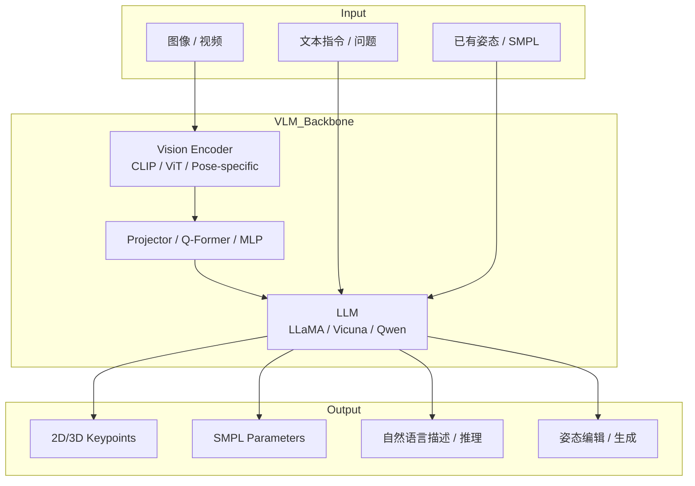
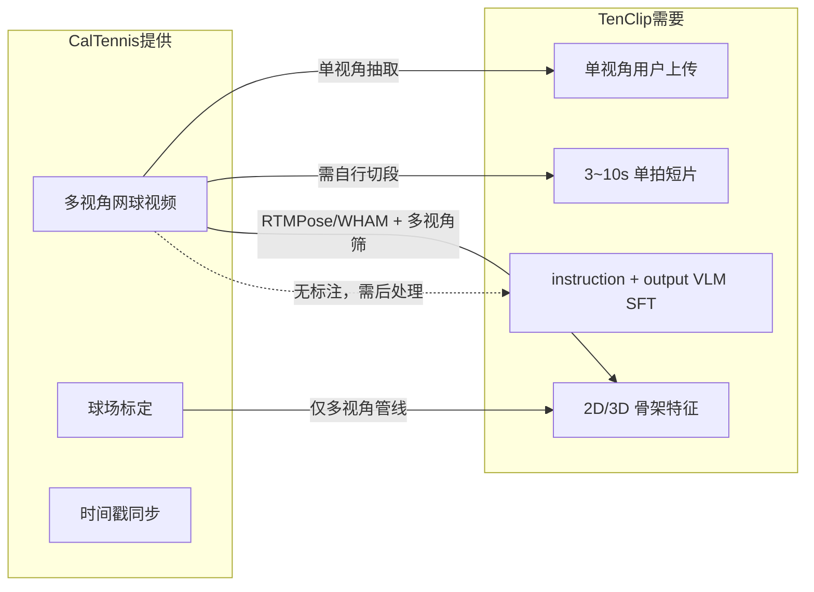

# VLM 姿态估计：论文综述与方法研究

> 调研时间：2026-06  
> 适用场景：TenClip 网球视频分析、VLM 训练数据构建、动作/姿态理解模块选型  
> 说明：本文聚焦 **Vision-Language Model（VLM / MLLM）与人体姿态估计（Human Pose Estimation, HPE）的交叉方向**，并补充与网球运动分析相关的传统与 VLM 方法对比。

---

## 1. 背景与动机

### 1.1 传统 HPE 的范式

经典人体姿态估计以 **CNN / Transformer 专用检测器** 为主，输出 2D/3D 关键点坐标或 SMPL 参数：

| 范式 | 代表方法 | 输出 | 特点 |
|------|----------|------|------|
| Top-down | HRNet, ViTPose, RTMPose | 2D keypoints | 先检测人框再回归关节，精度高、速度快 |
| Bottom-up | OpenPose, HigherHRNet | 2D keypoints | 多人场景友好 |
| 3D / SMPL | HMR, PARE, SMPLer-X | 3D mesh / SMPL θ, β | 单目 3D 重建 |
| 视频时序 | PoseC3D, ST-GCN | 骨架序列 + 动作标签 | 适合动作识别与生物力学 |

优势：**低延迟、可部署、指标明确（AP/MPJPE）**。  
局限：**语义理解弱**——能给出关节坐标，但难以自然语言解释「正手引拍是否充分」「重心是否前移」等教练级反馈。

### 1.2 VLM 介入 HPE 的核心价值

大视觉语言模型（VLM / MLLM）将 **视觉编码器 + 大语言模型** 统一，使系统同时具备：

1. **感知**：从图像/视频中理解人体结构与动作  
2. **推理**：多步因果分析（「因为肘部过低，所以击球点偏后」）  
3. **交互**：开放词汇问答、文本指令编辑姿态、自然语言纠错建议  

2023–2025 年出现一批 **「Pose + LLM / VLM」** 工作，可粗分为：

- **坐标回归型**：LLM 直接/间接输出关键点坐标（LocLLM, PoseLLM, ChatPose, CapeLLM）  
- **理解增强型**：关键点作为额外模态注入 VLM，强化人体场景问答（LLaVA-Pose, KptLLM）  
- **统一生成型**：姿态 token 化，支持理解、生成、编辑（UniPose, PoseScript 系列）  
- **行为/运动 VLM**：面向体育与日常活动的视频理解（BehaviorVLM 等）

---

## 2. 方法分类与技术路线



### 2.1 坐标回归型（Pose as Output Tokens）

**思路**：将 (x, y) 或 (x, y, v) 离散化为文本 token，让 LLM 以「生成」方式完成 HPE。

| 方法 | 会议/年份 | 基座 | 核心设计 | 典型数据集 |
|------|-----------|------|----------|------------|
| **LocLLM** | CVPR 2024 | Vicuna + CLIP | 多任务指令微调；GCoT 几何链式思维 | COCO, Human-Art, MP-100 |
| **PoseLLM** | 2024 | LLM + ViT | 层级 pose 词表；统一 2D/3D/Hand | COCO, Human3.6M, FreiHAND |
| **ChatPose** | CVPR 2024 | LLM | 对话式姿态：理解 + 生成 + 编辑 | COCO, MPII, 3D 数据 |
| **CapeLLM** | ICCV 2025 | MLLM | Category-agnostic pose estimation | MP-100, AP-10K 等 |

**LocLLM** 代表技术细节：

- 输入：图像 + 指令（如 “Locate the human keypoints”）  
- 输出：关键点坐标字符串，例如 `<loc010><loc022>...`  
- **GCoT（Geometric Chain-of-Thought）**：先定位头/躯干等 anchor，再回归其余关节，降低长序列误差  
- 在 COCO val 上可达与专用 SOTA 检测器可比 AP，同时支持 MP-100 等 **类别无关 / 少样本** 关键点

**ChatPose** 特点：

- 同一模型支持：2D/3D 姿态估计、文本生成姿态、姿态编辑  
- 将 SMPL 参数与 2D 关键点都纳入 LLM 词表  
- 强调 **multi-turn dialogue**，适合教练式交互产品原型

**CapeLLM**（2025）针对 **开放世界物体/动物/人体** 的关键点，弥补固定 17 点 COCO 骨架的局限，与网球场景中「球拍、人体、特殊动作」的灵活定义更相关。

### 2.2 理解增强型（Keypoints as Input Modality）

**思路**：先用专用 HPE 提取关键点，或将关键点渲染/嵌入到 VLM 输入，增强 **语义理解** 而非直接回归坐标。

| 方法 | 年份 | 做法 | 主要收益 |
|------|------|------|----------|
| **LLaVA-Pose** | 2025 | 20 万+ 关键点对齐指令数据微调 LLaVA-1.5 | E-HPAUB 上相对 LLaVA-1.5 **+33.2%** |
| **KptLLM** | 2024 | Keypoint Prompt Token + identify-then-detect | 关键点语义理解 83% vs 微调 LLaVA 72% |

适用 TenClip：**「检测用 RTMPose/MediaPipe，推理解释用 VLM」** 的级联架构，工程上最稳。

### 2.3 统一多模态姿态框架（Comprehension + Generation + Editing）

| 方法 | 会议 | 模态 | 能力 |
|------|------|------|------|
| **UniPose** | CVPR 2025 | 图像 / 文本 / SMPL | Pose tokenizer 将 3D 姿态离散化；统一理解、生成、编辑 |
| **PoseScript / PoseFix** | 前序工作 | 3D 姿态 → 文本 | 单姿态描述、双姿态差异描述 |
| **PoseLLM + ChatPose** | 见上 | 多模态 | 生成与编辑 |

UniPose 使用 **pose-specific visual encoder** + 通用 ViT 的混合编码，在 ImageScript、ImageDiff 等 benchmark 上显著超过 GPT-4V、Qwen-VL。

### 2.4 视频 / 行为理解 VLM

| 方法 | 年份 | 关注点 |
|------|------|--------|
| **BehaviorVLM** | 2026 | 长视频人体行为；与姿态/动作强相关 |
| **Qwen-VL / GPT-4V / Gemini** | 通用 VLM | 零样本动作描述强，但关键点数值精度不足 |

通用 VLM 适合 **粗粒度动作分类与描述**；细粒度关节角度、相位（引拍-挥拍-随挥）仍需专用 HPE 或 Pose-VLM 微调。

---

## 3. 代表论文详述

### 3.1 LocLLM: Exploiting Large Language Models for 3D Human Pose Estimation

- **链接**：https://arxiv.org/abs/2311.11661  
- **会议**：CVPR 2024  
- **问题**：如何让 LLM 具备 SOTA 级关键点定位能力，并泛化到 3D 与类别无关设定  
- **方法**：Multi-task visual instruction tuning（2D / 3D / category-agnostic）；坐标 tokenization + GCoT  
- **代码**：https://github.com/Yangyi0111/LocLLM  

### 3.2 ChatPose: Chatting about 3D Human Pose

- **链接**：https://arxiv.org/abs/2311.13004  
- **会议**：CVPR 2024 Highlight  
- **亮点**：对话式 3D 人体姿态——估计、生成、编辑统一在 chat 接口  

### 3.3 PoseLLM: Universal Pose Instruction Tuning

- **链接**：https://arxiv.org/abs/2403.08769  
- **特点**：层级 pose vocabulary，覆盖 body / hand / 3D  

### 3.4 CapeLLM: Category-Agnostic Pose Estimation with MLLM

- **会议**：ICCV 2025  
- **亮点**：开放类别关键点；文本或视觉 prompt 指定骨架语义  

### 3.5 UniPose: Unified Multimodal Framework for Human Pose Comprehension, Generation and Editing

- **链接**：https://arxiv.org/abs/2411.16781  
- **会议**：CVPR 2025  

### 3.6 LLaVA-Pose: Keypoint-Integrated Instruction Tuning

- **链接**：https://arxiv.org/abs/2506.21317  
- **代码**：https://github.com/Ody-trek/LLaVA-Pose  

### 3.7 KptLLM: Keypoint Comprehension with LLM

- **链接**：https://arxiv.org/abs/2411.01846  

---

## 4. 与传统 HPE 的对比

| 维度 | 专用 HPE（RTMPose, MediaPipe, ViTPose） | VLM / Pose-LLM |
|------|----------------------------------------|----------------|
| **2D AP / 速度** | 优（实时 30fps+） | 中（LLM 解码慢、量化误差） |
| **3D 精度** | 中（单目歧义） | 中–低（除非大量 3D 微调） |
| **开放词汇** | 弱 | 强（CapeLLM, KptLLM） |
| **自然语言反馈** | 需后接规则/LLM | 原生支持 |
| **少样本新关键点** | 需重新训练 | visual/text prompt 可尝试 |
| **部署成本** | 低（ONNX/TensorRT） | 高（7B+ 模型） |
| **可解释性** | 低（仅坐标） | 高（链式推理 GCoT） |

**实践共识（2025）**：

1. **生产管线**：专用 HPE 出骨架 → 结构化特征（角度、相位、对称性）→ VLM 生成教练文案  
2. **研究 / 端到端**：LocLLM、ChatPose、UniPose 探索「一个模型全包」  
3. **微调 TenClip VLM**：优先 **LLaVA-Pose 式** 数据（视频帧 + 关键点 + 网球专业 QA），而非从零回归坐标  

---

## 5. 网球与运动场景相关工作

纯 **VLM 网球姿态** 论文仍较少，多为 **传统 CV + 生物力学** 或 **通用 VLM 视频理解**：

| 方向 | 代表工作 | 方法 | 与 VLM 关系 |
|------|----------|------|-------------|
| **网球多视角 pose 评测** | **CalTennis** (arXiv:2606.20542) | 多机位 iPhone 视频 + 球场标定；无 GT，多视角一致性评测 | 不提供 VLM 文本标注；可作 pose 评测与伪标签源 |
| 网球动作生物力学 | arXiv:2606.15992 等 | MediaPipe 33 点 + 角度特征 + ML 分类 | 骨架来自传统 HPE，非 VLM |
| 网球动作识别 | ST-GCN, YOLO+LSTM | 骨架图 / 检测框时序 | 可作为 VLM 输入特征 |
| 通用人体视频 VLM | Qwen2-VL, GPT-4o | 零样本描述挥拍动作 | 无精确关节角 |
| 体育 Behavior VLM | BehaviorVLM | 行为级理解 | 可扩展至网球战术分析 |

**对 TenClip 的启示**：

- **短期**：MediaPipe / RTMPose 提取 2D 骨架 → 计算网球专用特征（肩髋分离角、肘角、手腕速度 proxy）→ 现有 VLM 做 narrative  
- **中期**：构建 **网球 Pose-Instruction 数据集**（参考 LLaVA-Pose + `build_vlm_dataset_from_videos.py`）；可借 **CalTennis mini** 做 pose 管线评测与伪标签试验  
- **长期**：在 Qwen3-VL 上 LoRA 微调 **「图像 + 关键点 token + 教练 Q&A」** 多任务  

### 5.1 CalTennis（Caltech Tennis Dataset）与 TenClip 落地分析

> 项目页：https://ilonadem.github.io/caltennis-website/  
> 论文：https://arxiv.org/html/2606.20542  
> 数据：https://huggingface.co/datasets/demalenk/caltennis（license: **CC-BY-NC-4.0**）

#### 5.1.1 数据集概览

CalTennis 是 **首个大规模、多视角、非脚本化** 的网球练习/比赛视频 benchmark，面向 **单目 → 3D 人体姿态估计** 的 in-the-wild 评测，而非 VLM 指令微调。

| 维度 | 内容 |
|------|------|
| 规模 | **1100 万+ 帧 / 51 小时 / 40 名球员**（校队～业余） |
| 采集 | 2–6 台 iPhone 同步，**60 fps，1080p**，球场三脚架（约 1.65 m 高） |
| 场景 | 非脚本化练习与比赛（发球、截击、冲刺等） |
| 拍摄距离 | 90% 人体距相机 **13.4–16.7 m**（远比 Human3.6M 远，接近场边手机拍法） |
| 附带文件 | 视频、`camera_calibration/*/calib.json`、`*.npy` 时间戳 |
| 隐私 | 人脸 blur；IRB + 知情同意 |
| 体量 | Hugging Face 全量约 **122 GB**；提供 `metadata_mini.jsonl` / `metadata_mid.jsonl` 子集 |

**不提供**：人工 3D pose 真值、击球类型标签、教练文本、球轨迹。

metadata 每行示例（无 `instruction` / `output`）：

```json
{
  "video": "01_23_2026_17_00_court2/....mp4",
  "timestamps": "..._timestamps.npy",
  "calibration": "camera_calibration/.../calib.json",
  "session_id": "01_23_2026_17_00_court2",
  "video_id": "..."
}
```

#### 5.1.2 核心方法：无标注多视角评测

CalTennis 的设计目标是 **label-free evaluation**，而非提供训练标签：

- 多视角 3D 重建若正确，投影到各视角应一致；**视角间 disagreement 构成误差下界**  
- 新增指标：**footwork（脚滑/脚高）**、**stability（重心 vs 支撑多边形）**、**body shape 一致性**  
- 论文在 PromptHMR、WHAM、GVHMR、TRAM、GENMO 上 benchmark，结论摘要：  
  - **关节角 / 相对 pose** 往往尚可（跨视角 pose error ~11 cm 量级）  
  - **绝对深度 / 平移** 极不稳定（translation error **0.9–3.6 m**）  
  - **脚地接触、体型（SMPL β）、metric 生物力学** 各模型均不可靠  

→ 与 TenClip 产品定位一致：**适合 2D 相对关节角 + 教练式 narrative，不宜承诺实验室级 3D 测力分析**。

#### 5.1.3 与 TenClip 模块匹配度



| 用途 | 匹配度 | 说明 |
|------|--------|------|
| 网球域 pose 选型 / 评测 | ⭐⭐⭐⭐⭐ | 论文目的即此；暴露 13–17 m 单目难点 |
| 多视角伪标签（研发） | ⭐⭐⭐⭐ | MLE 共识 + disagreement 筛高置信帧 → keypoints JSON |
| 模拟用户单视角上传 | ⭐⭐⭐⭐ | 每 session 取 1 机位即可 |
| 测试抽帧 / 切片管线 | ⭐⭐⭐ | 长 session 需 `slice_match_to_clips` 或击球检测二次切段 |
| 直接 VLM SFT | ⭐ | 无文本标注，不能 plug-and-play 进 manifest |
| 商用模型训练 | ⭐⭐ | **NC license**；上线前需作者授权或仅内部研发 |
| 线上多视角融合 | ⭐ | 用户一般只上传单路视频 |

#### 5.1.4 推荐落地路径

**阶段 A — 零风险试水（1–2 天）**

1. 仅下载 `metadata_mini.jsonl` 对应视频（HF mini split）  
2. 每个 `session_id` 选 **1 个机位**（模拟小程序单上传）  
3. 跑 RTMPose / MediaPipe，统计可见关节比例、挥拍峰值帧  
4. 手动切 10 段短片，对 `build_vlm_dataset_from_videos.py --dry-run` 验证 manifest 兼容  

**阶段 B — 伪标签扩充（研发；注意 license）**

1. 同 session 多视角 + `calib.json`  
2. WHAM / PromptHMR + 论文 Appendix A.1 MLE 共识融合  
3. 用 cross-view disagreement 筛帧  
4. 模板或规则生成弱监督 QA，与 **自有用户视频 manifest 混合** 再 LoRA  

**阶段 C — 不建议**

- 当作 FineGym 式动作分类集（无 stroke 标签）  
- 未解决 license 即用于商用 TenClip 线上模型  
- 不评测直接全量 122 GB 灌入 VLM  

#### 5.1.5 总评

| 评价项 | 结论 |
|--------|------|
| 网球场景匹配 | 公开集中最贴近 TenClip 用户拍法之一 |
| Pose 管线价值 | **值得用**——作试金石与伪标签原料 |
| VLM 训练价值 | **不能直接用**——需自建 instruction/output |
| 与 Cascade 架构 | CalTennis 评 pose → 自有 manifest 训 VLM → 线上单视角 RTMPose + VLM |

---

## 6. 数据集与评测指标

### 6.1 通用 HPE 数据集

| 数据集 | 类型 | 备注 |
|--------|------|------|
| COCO Keypoints | 2D 人体 | LocLLM / PoseLLM 主评测 |
| MPII | 2D | 经典 benchmark |
| Human3.6M | 3D | 3D HPE |
| MP-100 | 类别无关 2D | CapeLLM, KptLLM |
| Human-Art | 2D 多样场景 | 艺术/体育姿态 |

### 6.2 网球专用：CalTennis

| 项目 | 内容 |
|------|------|
| 名称 | CalTennis（Caltech Tennis Dataset） |
| 类型 | 多视角 in-the-wild 视频 + 球场相机标定 |
| 规模 | 11.03M 帧；mini/mid 子集见 HF `metadata_*.jsonl` |
| GT | **无** MOCAP / 人工 keypoints；评测靠多视角一致性 |
| 指标 | Translation / Pose error, MPJPE, PA-MPJPE, foot-skating, stability, shape |
| License | CC-BY-NC-4.0（商用 TenClip 需注意） |
| 近亲数据集 | WorldPose（世界杯）、AthletePose3D（实验室模仿）、SportsPose |

### 6.3 VLM pose 专用 benchmark

| Benchmark | 关联论文 | 评测内容 |
|-----------|----------|----------|
| E-HPAUB | LLaVA-Pose | 对话 / 描述 / 复杂推理 |
| ImageScript / ImageDiff | UniPose | 图像 → 姿态文本 / 差异描述 |
| PoseScript / PoseFix | UniPose 等 | 3D 姿态描述与编辑 |

### 6.4 指标

- **2D**：OKS-based AP, PCK@0.5  
- **3D**：MPJPE, PA-MPJPE  
- **VLM**：GPT-score, 人工偏好, E-HPAUB 任务准确率  
- **网球业务**：相位分类 Acc, 教练评分相关性（需自建标注）  

---

## 7. 技术实现要点（落地 TenClip）

### 7.1 推荐架构：Cascade Pose-VLM

```
视频 → 抽帧 → RTMPose/MediaPipe (2D)
              ↓
        骨架序列 + 角度特征 JSON
              ↓
        Qwen-VL / 微调 LLaVA-Pose
              ↓
        教练反馈 + 回合标签 + 用户 QA
```

### 7.2 若端到端 Pose-LLM 微调

1. **基座**：Qwen2-VL-2B/7B 或 LLaVA-1.5  
2. **训练任务混合**：坐标回归 (30%) + 动作描述 (40%) + 多轮纠错 (30%)  
3. **参考配置**：`configs/train/qwen3_vl_2b_qlora_sft_mm.yaml`  

### 7.3 推理加速

- 关键点：**ONNX RTMPose** 或 **MediaPipe** 边缘运行  
- VLM：**4bit 量化 + 短上下文**；仅对关键帧（击球瞬间）调用 VLM  

### 7.4 CalTennis 接入建议

与 §5.1 Cascade 架构的组合：

```
CalTennis 单视角视频
    → RTMPose/MediaPipe（在 mini 上评测 PCK / 漏检率）
    → [可选] 多视角伪标签 + disagreement 筛帧
    → 模板/规则/教练标注 → manifest（instruction + output）
    → build_vlm_dataset_from_videos.py → Qwen-VL LoRA
    → 线上：用户单上传 + 同款 pose 前端 + vlm_tennis 解释
```

**产品边界**（依据 CalTennis benchmark 结论）：对外文案避免「米级 3D 击球点 / 精确重心转移」；可强调引拍幅度、肘腕相对角度、动作相位等 **2D + 相对 kinematics**。

---

## 8. 研究趋势与开放问题

1. **精度 vs 语义**：LLM token 回归坐标仍存在量化误差；混合回归头（LLM hidden → MLP → coords）是趋势  
2. **视频时序**：多数 Pose-VLM 仍偏单帧；与 TenClip 的 clip 级时序需 ST-GCN 或 video adapter  
3. **3D 与场地几何**：网球需要相机标定 / 相对球场线才能给出「击球点前后」；纯 2D VLM 易幻觉  
4. **领域数据稀缺**：公开 **VLM 网球教练 QA** 仍空白；**CalTennis** 可补 **pose 评测与伪标签**，但无文本标注，仍需 `slice_match_to_clips.py` + 自有 manifest  
5. **统一模型**：UniPose / ChatPose 方向——一个模型完成理解+编辑，但部署成本高  

---

## 9. 推荐阅读顺序

| 顺序 | 论文 | 目的 |
|------|------|------|
| 1 | LocLLM (CVPR'24) | 理解 pose-as-token 与 GCoT |
| 2 | ChatPose (CVPR'24) | 对话式姿态产品形态 |
| 3 | LLaVA-Pose (2025) | 关键点注入 VLM 的数据工程 |
| 4 | UniPose (CVPR'25) | 统一理解/生成/编辑框架 |
| 5 | CapeLLM (ICCV'25) | 开放类别与网球自定义骨架 |
| 6 | KptLLM | 语义 + prompt 检测 |
| 7 | CalTennis 论文 + 项目页 | 网球 in-the-wild pose 评测与 TenClip 数据策略 |

---

## 10. 参考文献

1. Yang et al. **LocLLM.** CVPR 2024. https://arxiv.org/abs/2311.11661  
2. Feng et al. **ChatPose.** CVPR 2024. https://arxiv.org/abs/2311.13004  
3. **PoseLLM.** https://arxiv.org/abs/2403.08769  
4. **CapeLLM.** ICCV 2025.  
5. Li et al. **UniPose.** CVPR 2025. https://arxiv.org/abs/2411.16781  
6. Zhang et al. **LLaVA-Pose.** https://arxiv.org/abs/2506.21317  
7. **KptLLM.** https://arxiv.org/abs/2411.01846  
8. Chen et al. **RTMPose.** https://arxiv.org/abs/2303.07399  
9. Lugaresi et al. **MediaPipe.** https://arxiv.org/abs/1906.08172  
10. Plank et al. **PoseScript.** ECCV 2022.  
11. Delmas et al. **PoseFix.** ICCV 2023.  
12. Demler et al. **CalTennis: Large Multi-View Tennis Video Dataset and Benchmark of Monocular-to-3D Pose Estimation.** arXiv:2606.20542. https://arxiv.org/html/2606.20542  
13. CalTennis 项目页：https://ilonadem.github.io/caltennis-website/  
14. CalTennis Hugging Face：https://huggingface.co/datasets/demalenk/caltennis  

---

## 11. 与 TenClip 仓库的衔接

| 仓库路径 | 关联 |
|----------|------|
| `scripts/build_vlm_dataset_from_videos.py` | 扩展输出：帧 + 关键点 JSON + 教练 QA |
| `scripts/slice_match_to_clips.py` | 击球 clip 对齐，供时序 pose 采样 |
| `configs/train/qwen3_vl_2b_qlora_sft_mm.yaml` | 多模态 SFT 基线 |
| `services/vlm_tennis.py` | 接入 cascade：HPE 特征 → VLM prompt |
| Hugging Face `demalenk/caltennis` | mini 子集 pose 评测；多视角伪标签（§5.1、§7.4） |
| （待建）`scripts/caltennis_*` | 可选：mini 导入、单视角选取、manifest 骨架生成 |

---

*文档维护：§5.1 已纳入 CalTennis 与 TenClip 落地分析（2026-06）。后续可增补 RTMPose 在 mini 上的实测数字，或 `caltennis_to_manifest.py` 脚本说明。*
